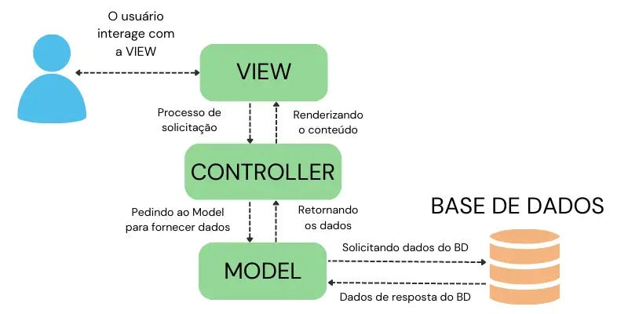
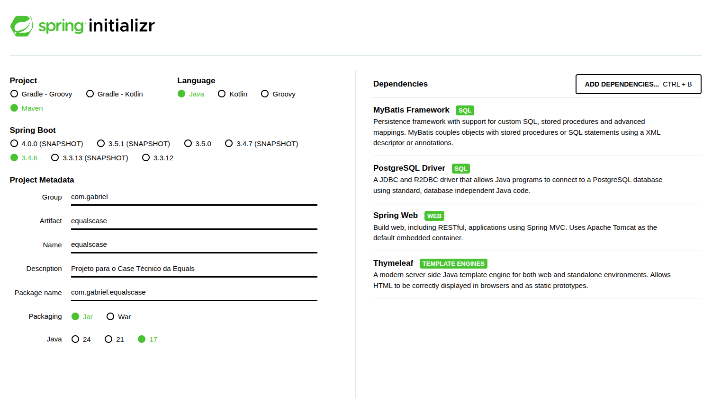

# Projeto Case Técnico Equals

## Executar projeto

Java: OpenJDK 17.0.15 (build 17.0.15+0, release em 2025-04-15)
PostgreSQL: V15.O
Spring Boot: 3.4.6

---
Para o banco de dados, foi utilizado um container do PostgreSQL:

    docker run --name postgres-equals   -e POSTGRES_USER=postgres   -e POSTGRES_PASSWORD=123456   -e POSTGRES_DB=equalsdb   -p 5432:5432   -d postgres:15.0

    sudo docker exec -it postgres-equals psql -U postgres -d equalsdb

### Definir variáveis de ambiente

Os campos colocados são penas exemplo!

No windows:
```
set DB_USER=postgres
set DB_PASS=123456
```

No Linux ou macOS:
```
export DB_USER=postgres
export DB_PASS=123456
```


### Execução

    ./mvnw spring-boot:run


## Elaboração do projeto

Essa aplicação foi planejada com a arquitetura **MVC(Model-View-Controller)**, pelo motivo de que tenho mais familiaridade com esse modelo e acredito que, para a tarefa em questão, seja adequado devido ao grau mais baixo de funcionalidades. Além disso, separar o Front e o Back seria bem mais trabalhoso e desnecessário visto que o projeto tem apenas 3 páginas. 



Especificamente, a arquitetura foi feita da seguinte forma:


### Tecnologias Utilizadas

1-**PostgreSQL:** Foi escolhido pela estabiliade e consistência, garantindo ACID(Atomicidade, Consistência, Isolamento e Durabilidade). Além disso, é open-source!

2-**MyBatis:** O ideal nesse case técnico era mostrar os meus conhecimentos sobre SQL também, o que justificaria não usar uma ORM. No entanto, essa ORM permite o controle direto das queries, o desenvolvedor escreve diretamente as queries. Além de permitir a separação da lógica de negócio do SQL em si.

2-**Thymeleaf:** Tornar possível a criação de páginas HTML de forma simples e fácil. Além disso, permite integrar o backend com frontend, sem quebrar a sintaxe.

**Projeto no Spring Initializr**




### O Grande Desafio no Projeto (e como foi resolvido)

Foi solicitado o **desenvolvimento de uma solução que permita ao sistema suportar a leitura de vendas de diferentes bandeiras, sem comprometer a evolução futura da Equals**.

O grande desafio nessa tarefa está no fato de que a escolha da bandeira será feita em tempo de execução, e não durante a compilação do sistema. Isso significa que o sistema precisará se adaptar dinamicamente, conforme a bandeira informada pelo usuário.

Como cada bandeira pode possuir modelos de dados e metadados distintos, todos os componentes envolvidos na leitura do arquivo e na gravação no banco de dados — como parsers e mappers — também precisam ser definidos ou selecionados em tempo de execução.

Entretanto, parsers e mappers são implementados com tipos específicos definidos em tempo de compilação, o que torna essa flexibilidade um desafio.

Portanto, o ponto crítico está em projetar uma arquitetura que permita essa variação dinâmica sem violar princípios de modularidade, reutilização e escalabilidade, garantindo que novas bandeiras possam ser integradas sem impactar ou exigir alterações no código já existente.

---

## Estratégia de Generalização e Injeção Dinâmica

A primeira abordagem adotada foi **generalizar os elementos envolvidos na leitura e persistência dos dados**, como *mappers* e *parsers*. Essa é, de fato, uma ideia correta, mas exige cuidados: uma generalização excessiva pode tornar o código inseguro e sensível a erros.

Para garantir segurança e flexibilidade, a generalização foi feita **limitando os tipos genéricos a superclasses específicas**. Ou seja, os tipos genéricos utilizados foram definidos de forma a herdar de uma classe base comum. Exemplo:

```java
public interface LeitorVendas<H extends Header, D extends Detalhe, T extends Trailer>
```

Com essa definição, garantimos que todos os parâmetros genéricos (`H`, `D`, `T`) respeitem o escopo esperado, evitando usos indevidos fora do domínio de `Header`, `Detalhe` e `Trailer`.

---

## Resolução com Spring e Injeção de Dependência

O segundo desafio foi solucionado com o suporte do Spring Framework. Utilizando os conceitos da documentação oficial:

* [Spring - Factory Collaborators](https://docs.spring.io/spring-framework/reference/core/beans/dependencies/factory-collaborators.html)
* [Baeldung - @Component Annotation](https://www.baeldung.com/spring-component-annotation)
* [Spring - @Component Javadoc](https://docs.spring.io/spring-framework/docs/current/javadoc-api/org/springframework/stereotype/Component.html)

Foi possível definir os *mappers* e *parsers* como componentes (`@Component`), permitindo que o Spring **injetasse automaticamente todos os beans disponíveis**, desde que respeitassem as limitações de tipo estabelecidas.

Exemplo:

```java
public ArquivoWebController(
        ProcessadorArquivoService processadorArquivoService,
        Map<String, HeaderMapper<?>> headerMappers,
        Map<String, DetalheMapper<?>> detalheMappers,
        Map<String, TrailerMapper<?>> trailerMappers) {

    this.processadorArquivoService = processadorArquivoService;
    this.headerMappers = headerMappers;
    this.detalheMappers = detalheMappers;
    this.trailerMappers = trailerMappers;
}
```

O Spring automaticamente cria um `Map` com as implementações disponíveis. Exemplo:

```
"mastervisaHeaderMapper" => HeaderMapper<HeaderMasterVisa>
```

Caso existam outras bandeiras, elas serão adicionadas ao `Map` automaticamente, desde que sigam o padrão de nomeação.

---

## Por que isso é importante?

Essa estratégia permite **obter dinamicamente o componente correto em tempo de execução**, com complexidade O(1), sem necessidade de estruturas rígidas como `if` ou `switch`, que aumentariam a complexidade do código.

Exemplo:

```java
String hKey = bandeira + "HeaderMapper";
HeaderMapper<?> headerMapper = headerMappers.get(hKey);
```

Neste caso, o `HeaderMapper` correspondente à bandeira selecionada é obtido diretamente pelo nome do bean, utilizando um padrão de nomes.

Essa solução torna o sistema **extensível, seguro e fácil de manter**, permitindo que novas bandeiras sejam integradas **sem modificar o código existente**, exatamente como foi solicitado.

---

## Padrão de Nomeação (IMPORTANTE)

Para que a injeção dinâmica funcione corretamente, é fundamental manter um padrão de nomes consistente nos componentes.

### Mappers

Os *mappers* devem seguir este padrão:

```
@Component("nomedabandeiraHeaderMapper")
```

Exemplo:

```java
@Component("mastervisaDetalheMapper")
```

### Parsers

Os *parsers* devem seguir este padrão:

```
@Component("nomedabandeiraLeitor")
```

Exemplo:

```java
@Component("mastervisaLeitor")
```

---

### Estratégia de paginação usando MyBatis

<!-- Consulta paginada com filtros dinâmicos -->

```
    <select id="buscarPaginado" resultType="com.gabriel.equalscase.model.visamaster.DetalheMasterVisa">
        SELECT * FROM detalhe
        <where>
            <if test="dataInicial != null and dataInicial != ''">
                AND data_transacao &gt;= #{dataInicial}::date
            </if>
            <if test="dataFinal != null and dataFinal != ''">
                AND data_transacao &lt;= #{dataFinal}::date
            </if>
            <if test="instituicao != null and instituicao != ''">
                AND instituicao_financeira = #{instituicao}
            </if>
        </where>
        ORDER BY id
        LIMIT #{tamanho} OFFSET #{offset}
    </select>
```

Esse select basicamente retorna os dados dos detalhes de acordo com o "estado" da consulta. Se existir uma data final, ele adiciona na pesquisa, o mesmo com a data inicial e instituição. O offset serve para dar o ponto de partida dos dados do select, basicamente para pular as linhas.
---

## Padrões de Projeto Utilizados

Este projeto faz uso de diversos padrões de design para garantir flexibilidade, modularidade e manutenção eficiente:

- **Factory Method**  
  Implementado na classe `LeitorFactory`, responsável por retornar diferentes implementações de `LeitorVendas` com base na bandeira fornecida.

**Método da classe LeitorFactory:**
  ```
    public <H extends Header, D extends Detalhe, T extends Trailer>
    LeitorVendas<H, D, T> getLeitor(String bandeira) {
        LeitorVendas<?, ?, ?> leitor = leitores.get(bandeira + "Leitor");

        if (leitor == null) {
            throw new IllegalArgumentException("Bandeira não suportada: " + bandeira);
        }

        // Cast é seguro porque o registro é controlado por nome de bean
        return (LeitorVendas<H, D, T>) leitor;
    }
  ```

---
- **Strategy**  
  Cada implementação de `LeitorVendas` representa uma estratégia diferente para o processamento de arquivos com formatos distintos, como Master/Visa, por exemplo.

---

- **Dependency Injection (DI)**  
  Utilizado por meio do Spring, permitindo a injeção automática de parsers e mapeadores, desacoplando as dependências.

**Método da classe ProcessadorArquivoService:**
  ```
  public ProcessadorArquivoService(
            Map<String, HeaderMapper<? extends Header>> headerMappers,
            Map<String, DetalheMapper<? extends Detalhe>> detalheMappers,
            Map<String, TrailerMapper<? extends Trailer>> trailerMappers,
            LeitorFactory leitorFactory) {

        this.headerMappers = headerMappers;
        this.detalheMappers = detalheMappers;
        this.trailerMappers = trailerMappers;
        this.leitorFactory = leitorFactory;
    }

  ```

---

- **Inversão de Controle (IoC)**  
  O framework Spring gerencia o ciclo de vida dos beans e a resolução de dependências, promovendo uma arquitetura desacoplada e testável.

**Método da classe ArquivoWebController:**
  ```

  public ArquivoWebController(
            ProcessadorArquivoService processadorArquivoService,
            Map<String, HeaderMapper<?>> headerMappers,
            Map<String, DetalheMapper<?>> detalheMappers,
            Map<String, TrailerMapper<?>> trailerMappers) {

        this.processadorArquivoService = processadorArquivoService;
        this.headerMappers = headerMappers;
        this.detalheMappers = detalheMappers;
        this.trailerMappers = trailerMappers;
    }

  ```

---