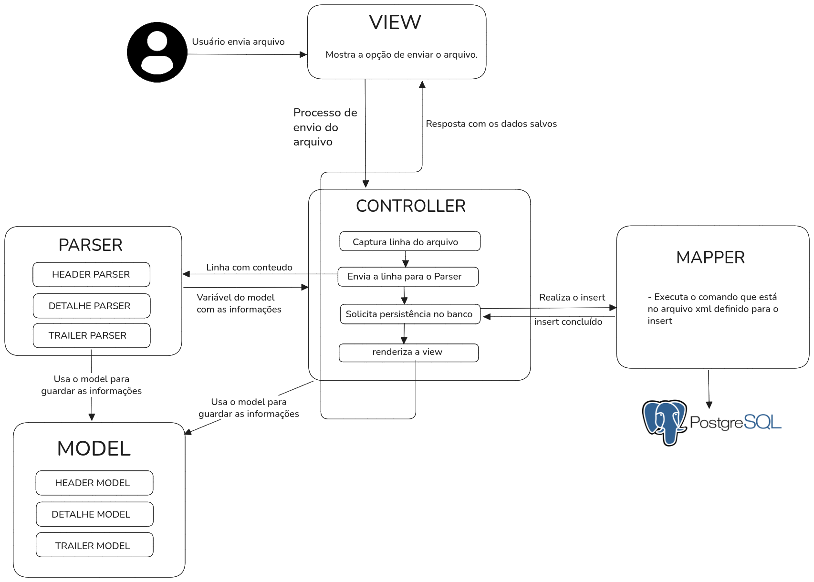

# Projeto Case Técnico Equals

## Executar projeto

---

    docker run --name postgres-equals   -e POSTGRES_USER=postgres   -e POSTGRES_PASSWORD=123456   -e POSTGRES_DB=equalsdb   -p 5432:5432   -d postgres:15

    sudo docker exec -it postgres-equals psql -U postgres -d equalsdb

### Definir variáveis de ambiente

No windows:
```
set DB_USER=postgres
set DB_PASS=123456
```

No Linux ou macOS:
```
export DB_USER=postgres
export DB_PASS=123456
```


### Execução

    ./mvnw spring-boot:run


## Elaboração do projeto

Essa aplicação foi planejada com a arquitetura **MVC(Model-View-Controller)**, pelo motivo de que tenho mais familiaridade com esse modelo e acredito que, para a tarefa em questão, seja adequado devido ao grau mais baixo de funcionalidades. Além disso, separar o Front e o Back seria bem mais trabalhoso e desnecessário visto que o projeto tem apenas 3 páginas. 


Especificamente, a arquitetura foi feita da seguinte forma:




### Tecnologias Utilizadas

1-**PostgreSQL:** Foi escolhido pela estabiliade e consistência, garantindo ACID(Atomicidade, Consistência, Isolamento e Durabilidade). Além disso, é open-source!

2-**MyBatis:** O ideal nesse case técnico era mostrar os meus conhecimentos sobre SQL também, o que justificaria não usar uma ORM. No entanto, essa ORM permite o controle direto das queries, o desenvolvedor escreve diretamente as queries. Além de permitir a separação da lógica de negócio do SQL em si.

2-**Thymeleaf:** Tornar possível a criação de páginas HTML de forma simples e fácil. Além disso, permite integrar o backend com frontend, sem quebrar a sintaxe.

**Projeto no Spring Initializr**


